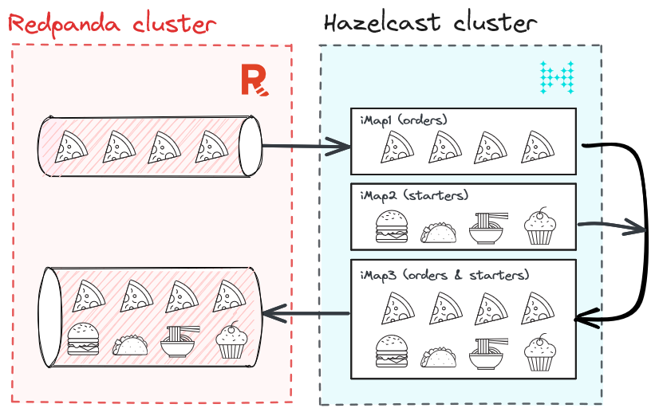

# real-time stream processing with Hazelcast and Redpanda
Welcome to this tutorial, where we will explore the powerful combination of Hazelcast and Redpanda to build high-performance, scalable, and fault-tolerant applications that react to real-time data.  

In this demo, we will guide you through setting up and integrating these two technologies to enable real-time data ingestion, processing, and analysis for robust streaming analytics. By the end, you will have a solid understanding of how to leverage the combined capabilities of Hazelcast and Redpanda to unlock the potential of streaming analytics and instant action for your applications.




## Step 1: Start the Redpanda cluster
```
docker compose up -d
```

## Step 2: Run Hazelcast
```
hz start
```
## Step 3: Run SQL on Hazelcast
```
bin/hz-cli sql
```
## Step 4: Ingest into Hazelcast iMap (pizzastream)
```
CREATE OR REPLACE MAPPING pizzastream(
timestamp_ TIMESTAMP,
pizza VARCHAR,
user_id VARCHAR,
quantity DOUBLE
)
TYPE Kafka
OPTIONS (
'keyFormat' = 'varchar',
'valueFormat' = 'json-flat',
'auto.offset.reset' = 'earliest',
'bootstrap.servers' = 'localhost:19092');
```
## Step 5: Enrich the stream with recommendations data (recommender)
```
CREATE or REPLACE MAPPING recommender (
__key BIGINT,
user_id VARCHAR,
extra1 VARCHAR,
extra2 VARCHAR,
extra3 VARCHAR )
TYPE IMap
OPTIONS (
'keyFormat'='bigint',
'valueFormat'='json-flat');
```
```
INSERT INTO recommender VALUES
(1, 'user_1', 'Soup','Onion_rings','Coleslaw'),
(2, 'user_2', 'Salad', 'Coleslaw', 'Soup'),
(3, 'user_3', 'Zucchini_fries','Salad', 'Coleslaw'),
(4, 'user_4', 'Onion_rings','Soup', 'Jalapeno_poppers'),
(5, 'user_5', 'Zucchini_fries', 'Salad', 'Coleslaw'),
(6, 'user_6', 'Soup', 'Zucchini_fries', 'Coleslaw'),
(7, 'user_7', 'Onion_rings', 'Soup', 'Jalapeno_poppers'),
(8, 'user_8', 'Jalapeno_poppers', 'Coleslaw', 'Zucchini_fries'),
(9, 'user_9', 'Onion_rings','Jalapeno_poppers','Soup');
```
## Step 6: Combine both Maps using SQL
```
SELECT
    pizzastream.user_id AS user_id,
    recommender.extra1 as extra1,
    recommender.extra2 as extra2,
    recommender.extra3 as extra3,
     pizzastream.pizza AS pizza
FROM pizzastream
JOIN recommender
ON recommender.user_id = recommender.user_id 
AND recommender.extra2 = 'Soup';
```

## Step 7: Send the combined data stream to Redpanda
```
CREATE OR REPLACE MAPPING recommender_pizzastream(
timestamp_ TIMESTAMP,
user_id VARCHAR,
extra1 VARCHAR,
extra2 VARCHAR,
extra3 VARCHAR,
pizza VARCHAR
)
TYPE Kafka
OPTIONS (
'keyFormat' = 'int',
'valueFormat' = 'json-flat',
'auto.offset.rest' = 'earliest',
'bootstrap.servers' = 'localhost:19092'
);

CREATE JOB recommender_job AS SINK INTO recommender_pizzastream SELECT
    pizzastream.timestamp_ as timestamp_,
    pizzastream.user_id AS user_id,
    recommender.extra1 as extra1,
    recommender.extra2 as extra2,
    recommender.extra3 as extra3,
    pizzastream.pizza AS pizza
FROM pizzastream
JOIN recommender
ON recommender.user_id = recommender.user_id 
AND recommender.extra2 = 'Soup';

```
